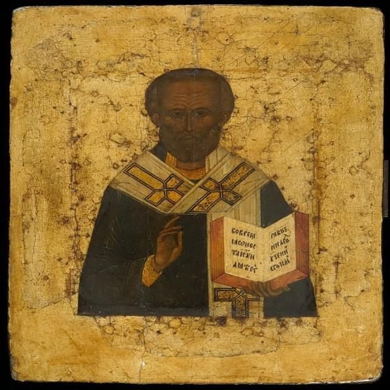
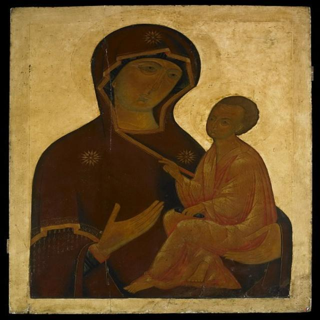
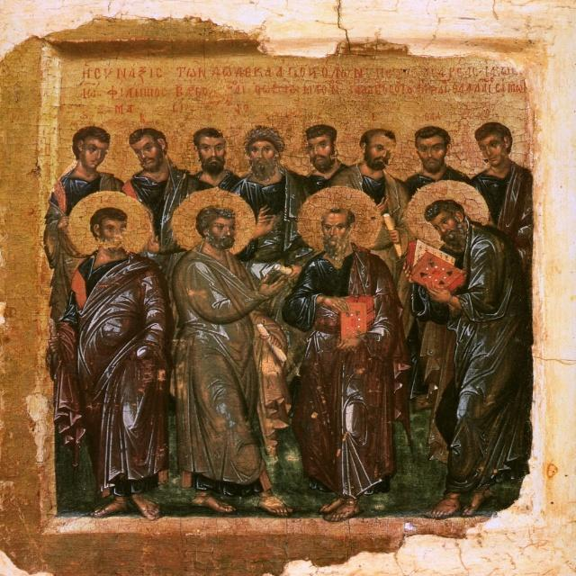
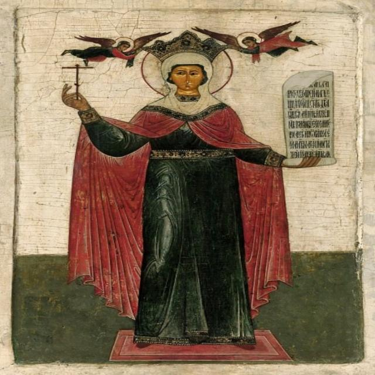

# ByzArt Dataset - (Under Review in ACM JOOCH)

This dataset was manually constucted and annotated using images of icons found in photographs of Mount Athos, Greece and the exhibition of the Byzantine Museum in Athes, Greece. 

---

## 📖 About The Project
Byzart aims to be used for object detection of Orthodox Christian art, which currently is underrepresented in the field of AI.
* The main motivation of this project is to facilitate a new avenue of AI research in the domain of art and in particular Christian art.
Provide a more detailed explanation of your project.
* Our dataset has been used for both complex and more lightweight networks: ranging from YOLO8 to YOLO12 networks, as well as DETR/RT-DETR and RF-DETR.
* If you would like to test and replicate my work, you can download the models from Roboflow and train them on Byzart using your own GPU, or even better train them on Google Colab!
* We believe that the ByzArt dataset contributes to a currently underrepresented avenue of religious art data for deep learning technologies.

---

## 📊 Dataset Preview

Here are some sample images from the datasets, which are located in the `/ByzArt2K/Documents/ByzArt` directory of this repository.

### Image Samples

| Sample 1 / Sample 2 | Sample 3 / Sample 4 |
| :---: | :---: |
|  |  |
| *Caption: An icon depicting one of the holy church fathers* | *Caption: An icon depicting the scene of the nursing mother* |
|  |  |
| *Caption: Holy men gathering* | *Caption: Saint Catherine* |

---

## 📁 Dataset Structure

The dataset is presented here in PASCAL VOC annotation format in order to facilitate an easier inspection of the bounding box annotations in the corresponding .xml files of each image.
The datasets have been split originally in a 70-20-10 split fashion. Since its best practice to only perform image augmentation on the training splits, the 3x and 5x dataset versions have an increased train, however the other splits remain same as in base
